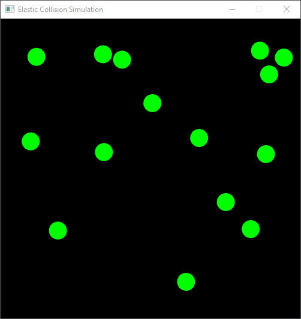

# ElasticCollisionSimulation
This program simulates elastic collisions of balls in a boxed area. For more information on this topic see [Wikipedia](https://en.wikipedia.org/wiki/Elastic_collision).

### Installation
There is no installation required. Just download the **ElasticCollisionSimulation.exe** (from [Releases](https://github.com/dadul96/ElasticCollisionSimulation/releases)) and run the simulation. When executing the program for the first time,
a **config.ini** file will be created in the same folder. At the next program start, the config settings are loaded from this file. The config file allows the following settings:
* Background color
* Ball count
* Ball radius
* Ball velocity
* Ball color

### Built With
* [Visual Studio 2019](https://visualstudio.microsoft.com/) - IDE used for programming
* [SFML](https://www.sfml-dev.org/) - Library used for creating the GUI

### Note
The SFML-Library was built for Visual Studio 2019 and 32bit target systems. If you are using other versions of VS you might need to change the library in the dependencies-folder.

### Author
**Daniel Duller** - [dadul96](https://github.com/dadul96)

### License
This project is licensed under the MIT License - see the [LICENSE](LICENSE) file for details.

### Acknowledgments
* Inspired by **Oscar Villarreal** - [oscardve](https://github.com/oscardve)
* Screen-GIF recorded with - [ShareX](https://getsharex.com/)
